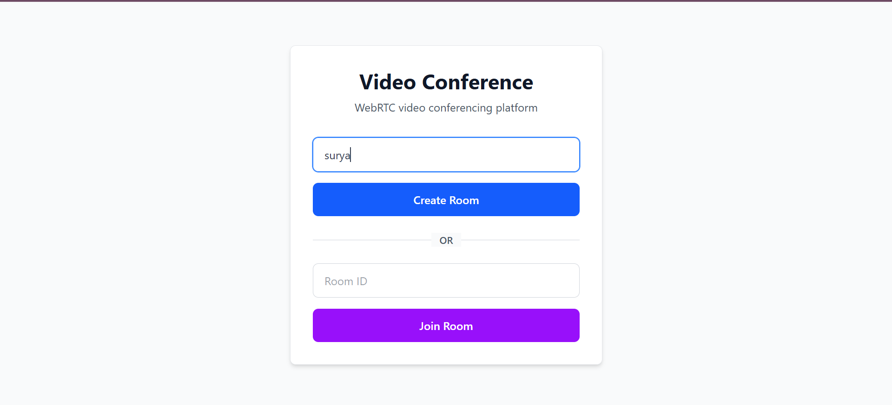

# Open Stream - WebRTC Video Conference Application



A simple, production-ready WebRTC video conferencing application using mediasoup SFU (Selective Forwarding Unit) with room-based invites and participant management.

## Features

- Multi-room support with isolated peer connections
- JWT-based room invite tokens with shareable links
- Real-time participant list with audio/video status
- Clean, professional UI with responsive design
- WebRTC media routing via mediasoup
- Type-safe implementation with TypeScript
- Socket.IO signaling for WebRTC setup

## Quick Start

### Prerequisites
- Node.js 18+ 
- npm or yarn

### Installation

```bash
# Clone repository
git clone https://github.com/suryapratap64/Open-stream.git
cd Open-stream

# Install dependencies (root)
npm install

# Install frontend dependencies
cd frontend
npm install
cd ..

# Create .env file
cp .env.example .env

# Configure .env (edit with your values)
PORT=3000
PUBLIC_IP=127.0.0.1  # or your server IP for production
JWT_SECRET=your-secret-key-here
NODE_ENV=development
VITE_API_URL=http://localhost:3000
```

### Running Locally

```bash
# Terminal 1: Backend
npm run dev

# Terminal 2: Frontend
cd frontend
npm run dev
```

Access frontend at `http://localhost:5173`

## Architecture

```
Browser (React + Socket.IO)
    |
    | WebRTC + Signaling
    |
Node.js Backend
    |
    +-- Express + Socket.IO (signaling)
    |
    +-- Mediasoup Service
        +-- Worker pool
        +-- Router per room
        +-- Transports, producers, consumers
        +-- RTP media forwarding
```

## How It Works

1. **Create Room**: Host generates invite link with JWT token
2. **Join Room**: Guest joins using link/token
3. **Media Setup**: Browser negotiates WebRTC transports via Socket.IO
4. **Produce**: Each peer sends audio/video to mediasoup
5. **Consume**: Each peer receives other participants' media

## API Endpoints

### REST
- `POST /invite/create?roomId={roomId}` - Generate invite token
- `GET /invite/validate/{token}` - Validate invite token

### Socket.IO Events

**Client → Server:**
- `join` - Join room with token
- `produce` - Send audio/video producer info
- `consume` - Request to consume remote producer
- `resume` - Resume suspended consumer

**Server → Client:**
- `peers` - List of room participants
- `newPeer` - New participant joined
- `newProducer` - New media stream available
- `consumerClosed` - Participant stopped streaming

## Environment Variables

```
PORT              - Server port (default: 3000)
PUBLIC_IP         - Server IP for WebRTC candidates
JWT_SECRET        - Secret key for token signing
NODE_ENV          - Environment (development/production)
VITE_API_URL      - Frontend API endpoint
```

## Project Structure

```
.
├── src/
│   ├── mediasoup/
│   │   ├── room.ts         - Room and peer management
│   │   ├── inviteManager.ts - JWT token handling
│   │   └── mediasoupService.ts - Media worker pool
│   └── types/
│       └── index.ts        - TypeScript definitions
├── frontend/
│   ├── src/
│   │   ├── App.tsx         - Main React component
│   │   ├── App.css         - Tailwind styling
│   │   └── main.tsx
│   └── package.json
├── server.ts               - Express + Socket.IO server
├── package.json
└── .env.example
```

## Building for Production

```bash
# Build both backend and frontend
npm run build

# Or build separately
npm run build:backend
npm run build:frontend
```

## Deployment

### Important: Vercel Limitations

Mediasoup will NOT run on Vercel due to:
- Missing system libraries (libsrtp, openssl, libwebrtc)
- Network restrictions on UDP/TCP ports
- Memory limitations for WebRTC workloads

### Recommended: Railway Deployment

Railway (https://railway.app) supports mediasoup with:
- Full system library access
- Open UDP/TCP ports for media
- Generous free tier
- No serverless limitations

**Steps:**
1. Push to GitHub
2. Connect Railway to repo
3. Set environment variables
4. Deploy backend to Railway
5. Deploy frontend to Vercel (or Railway)

### Alternative: Your Own VPS

DigitalOcean, Linode, AWS EC2, or similar with:
- Ubuntu/Debian base
- Node.js installed
- Full network access

## Troubleshooting

**"Missing parameter name" error on startup:**
- Check server.ts catch-all route uses `app.use()` not `app.get()`
- Verify Express middleware order is correct

**No video/audio:**
- Check browser permissions (camera/microphone)
- Verify .env PUBLIC_IP matches your server
- Check browser console for WebRTC errors
- Ensure firewall allows UDP ports 10000-20000

**Connection refused:**
- Backend not running? Start with `npm run dev`
- Check PORT in .env matches startup message
- Verify frontend VITE_API_URL points to backend

**Peer doesn't appear:**
- Refresh browser page
- Check Socket.IO connection in DevTools Network tab
- Verify room token is valid with `/invite/validate/{token}`

## Technology Stack

- **Frontend**: React 19, Vite, Tailwind CSS, Socket.IO Client
- **Backend**: Node.js, Express 5, Socket.IO 4, TypeScript
- **WebRTC**: mediasoup 3, mediasoup-client
- **Auth**: JWT tokens
- **Build**: TypeScript, npm scripts

## License

MIT License - see LICENSE file for details

## Support

For issues and questions:
- GitHub Issues: https://github.com/suryapratap64/Open-stream/issues
- Check FAQ.md for common questions
- Review SETUP.md for detailed setup guide
